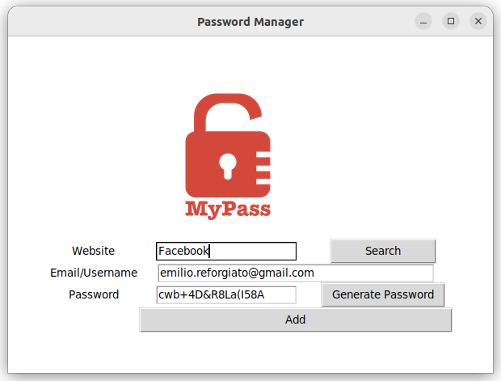

## Password Manager

**Password Manager** written in Python using the Tkinter library.
Program will write, and search in json file name of web site and random password generate with [**PyPassword Generator**](https://github.com/resole79/password_random_generator)       


###### It's a part of the **#100DaysOfCode** challenge by *Angela Yu*. ######      


#### Prerequisites
You will need the following software to run the Password Manager:
 - [Python 3](https://www.python.org/downloads/)

#### Installation
To get started with the **Password Manager**, follow these steps:

1. **Clone** the repository:

```sh
git clone https://github.com/resole79/password_manager_gui.git
```

3. **Run** the **main.py** file:

```sh
python main.py
```

#### File Structure   
 - **main.py**: Main program.

 

       


## **Credit**

Author : Emilio Reforgiato (resole79)

##
<p align="right"><a href="https://www.linkedin.com/in/emilio-reforgiato/" target=”_blank” ></a></p>


